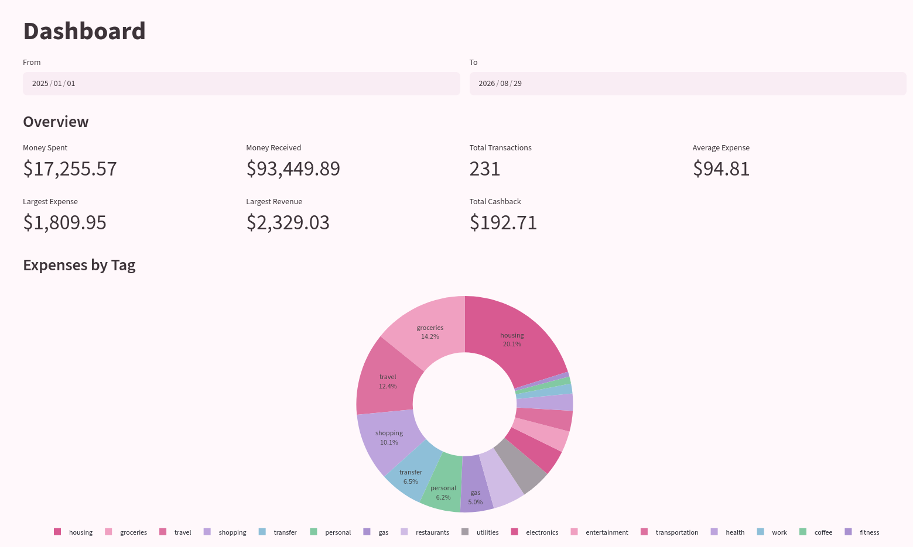
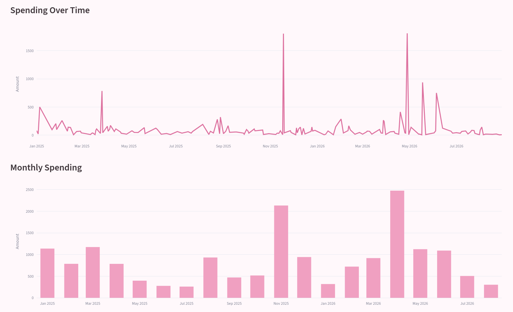
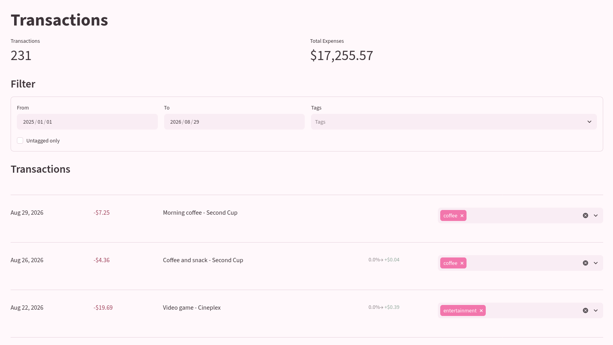
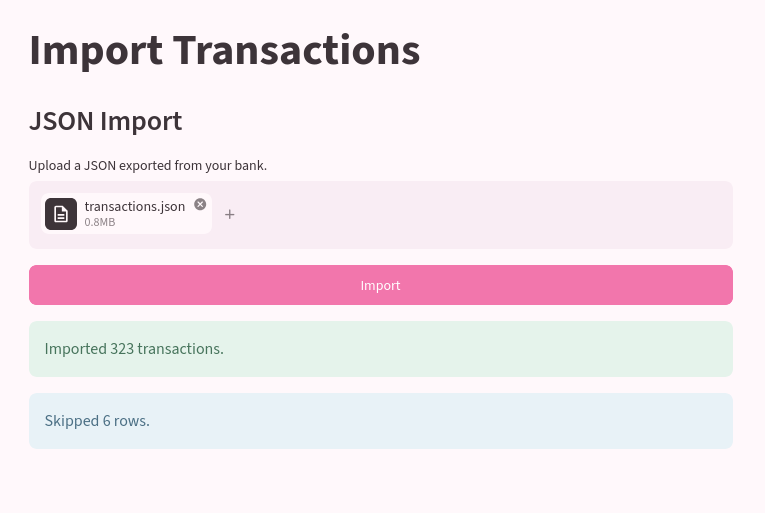
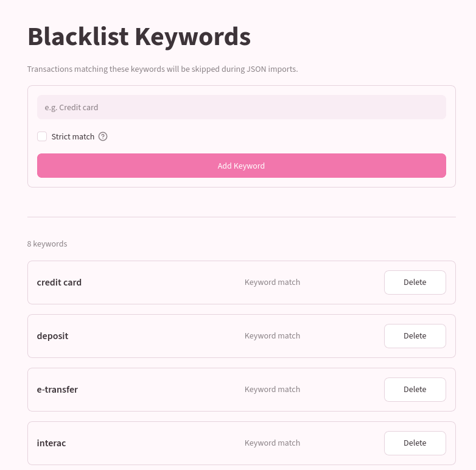
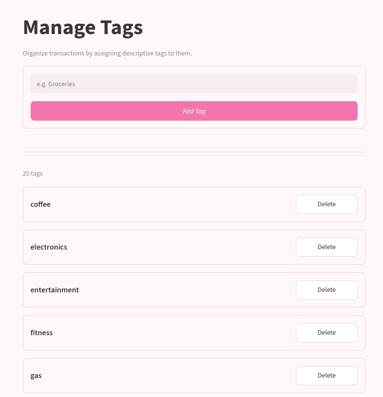

# Expenses Tracker

Python Streamlit web application that enables me to import my bank's JSON transaction history and manage it through tags and analytics.

It is secured using HTTPS and TLS client authentication through self-signed certificates.

> [!NOTE]
> The application's import feature was developed specifically for my 
> bank's JSON format. However, you may rewrite it to adapt it to 
> other formats.

## Showcase

### Dashboard

### Viewing and tagging transactions

### Importing transactions

### Black listing keywords from transaction description to clean imports

### Managing tags

## Getting started

This application is deployed through Docker Compose, with a Caddy web server acting as a reverse proxy. For security reasons, it is only meant to be deployed on local home networks.

HTTPS is enabled (and mandatory) through a self-signed certificate automatically generated by Caddy.
To access the application, the client needs a TLS/SSL certificate to authenticate itself to the web server.

### Setup
Follow these steps:

1. Navigate to the `deployment/` directory: `cd deployment`.
2. Launch the `./setdomain.sh <domain.name>` to set the domain name that the application will be served on.
3. Create your own private TLS/SSL Certificate Authority (CA). 
4. Create a client authentication TLS/SSL certificate through your private CA.
5. Bundle the client certificate and the client private key together in the PKCS #12 file format.
6. Replace the `caddy-conf/certs/replace-me-ca.crt` file with the CA's certificate (name it `client-ca.crt`). It will be used to verify client authentication certificates.
7. Deploy the containers with `docker compose up`.
8. Retrieve Caddy's root CA certificate with `cat caddy_data/caddy/pki/authorities/local/root.crt`. It is valid for 10 years.
9. In your browser of choice, import Caddy's root CA certificate and the PKCS #12 client authorization file. For mobile devices, this will probably be managed from the phone's settings.

The application will be available at `https://<domain.name>`.
